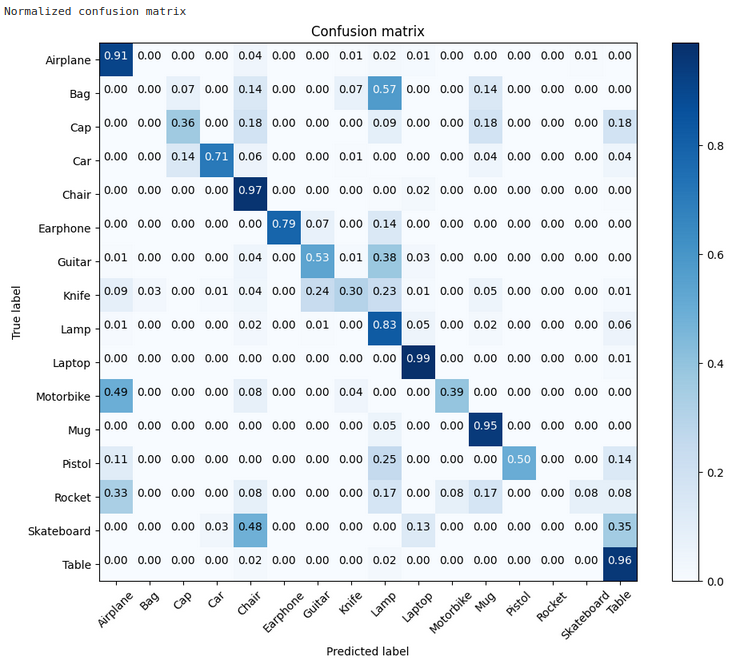

# PointNet

This is an unofficial PyTorch implementation of the PointNet architecture as described in the paper [PointNet: Deep Learning on Point Sets for 3D Classification and Segmentation](https://arxiv.org/abs/1612.00593). The repository contains the implementation of the classification network and the segmentation network (coming soon).

## Classification

Run `pointnet_classification.ipynb` to train and test the classification network. The network is trained on the ShapeNet dataset. The dataset is downloaded using the code provided in the Jupyter notebook.

### Results

The confusion matrix for the classification network after training for 20 epochs is shown below:

## Acknowledgements

[itberrios](https://github.com/itberrios) for providing detailed explanations and code snippets for the implementation of the PointNet architecture.

